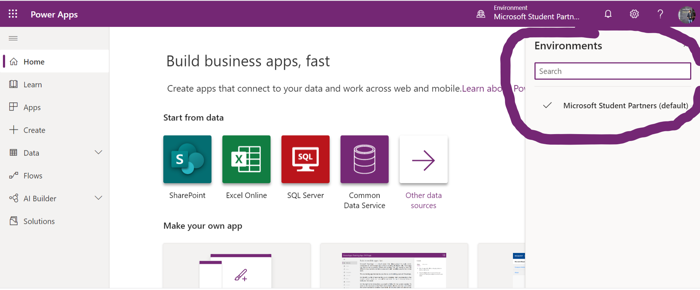
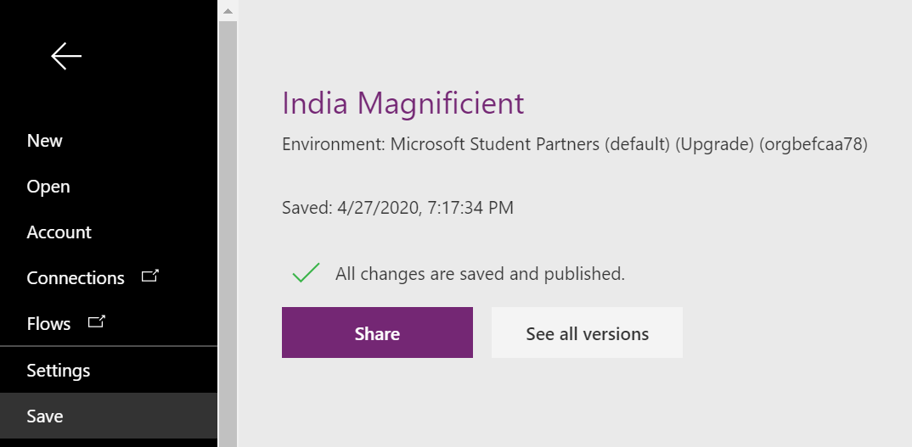
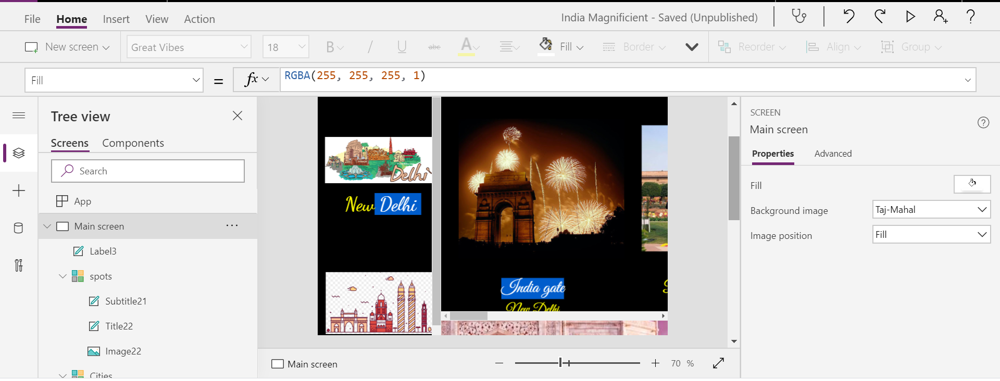
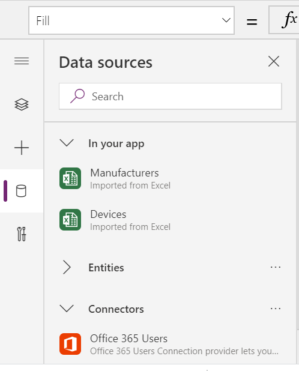

# Creating Your First Canvas App in Power App

## Just starting with the power app??🧐

__I, Recommend to go through this resources__
<ul>
  <li>Microsoft learn docs : https://docs.microsoft.com/en-us/learn/paths/create-powerapps/?WT.mc_id=twitter-social-donasa></li>
<li>#Do the Thing : https://donasarkar.com/f/you-want-an-upskilling-academy-you-say/?WT.mc_id=personal-blog-donasa> </li>
</ul>

__Prerequiste:__
 confirm that you have provisioned an environment where you will save your apps, flows and database entities.
 
 ## Task 1: Sign-in to Power Apps web studio 
 
 1.> Go to http://powerapps.microsoft.com and click Sign-in. You may also directly navigate to http://make.powerapps.com.  
 
 
 2> setup the enviornment 
 
 
 
 </img>
 
 
 ## Task 2: Create a new application  
 
1.> Select Home and click Canvas App from Blank. 

</img>

2.>create the App 

3.> Customize your app as per your requirements
Add the colour , texts, pics , background and other stuffs as per your requirments.

</img>
          

4.>Add a data source to your application using connector , you can use your excel sheet as a connector

</img>

5.>Select Play Start app preview arrow in the upper-right corner to practice using the app. Notice that it includes all the data from the table and provides a good default experience.

All apps that are generated from data have the same set of screens that you can view from the Screens pane:

Browse screen - This screen appears by default. In it, you can browse, sort, filter, and refresh the data from the data source. In the browse screen, you can add items to the data source by selecting the plus sign (+).
Details screen - The details screen shows all information about a single item. In this screen, you can open an item to edit or delete it.
Edit/create screen - In this screen, you can edit an existing item or create a new one.
__To make your app visible on the phone, it needs to be saved. Select File, Save as. Replace the current title "App" with Name app, and then select Save. You will see a green check mark when all changes are successfully saved. You can now open the app on your phone.__

</img>

 
 
 
